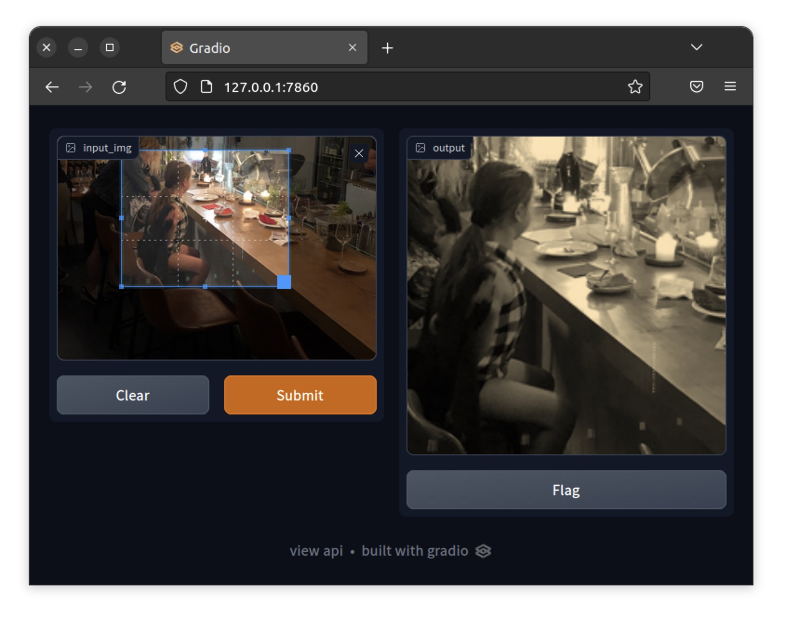

# Gradimio

Gradio based image input-process-output template.
There is nothing new in this repo.
It's just a simpliest demo of the [Gradio](https://gradio.app/ "Gradio") for the purpose of image uploading, processing, and display the result.

**Gradimio** is derived from Gradio + image + input-process-output.
**Yes, that's it!**

# Getting Started
## Simplest way
```bash
docker run -it --name=gradimio -p 7860:7860 geeksloth/gradimio:latest
```
then access it via your browser:
```127.0.0.1:7860```
The image is mainly built in ARMv8, ie., Apple Silicon M1. So if you could not run the image, I recommend you to follow the next following method instead.

## More practical way
1. Clone this repo and get into it
```bash
git clone https://github.com/geeksloth/gradimio.git && cd gradimio
```

2. Prepare the Docker image

    1. Build your own Docker image from provied Dockerfile:
``` docker build -t gradimio --network=host .```
    2. clone the image from GeekSloth's repo:
``` docker pull geeksloth/gradimio:latest```


3. Run the container from previous built image, and also binding the current directory into it.
```bash
docker run -it --rm --name=gradimio -p 7860:7860 -v $PWD:/gradimio gradimio:latest bash
```
and then run your script eg. ```python3 main.py```
